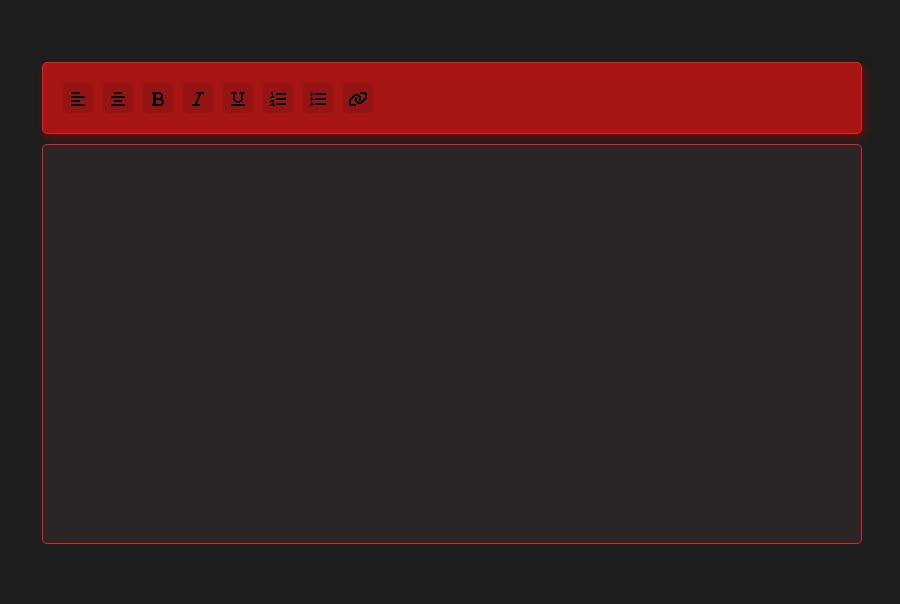

<h1 align="center"> Rich text editor </h1>

 

## 🚀 Tecnologias

Esse projeto foi desenvolvido com as seguintes tecnologias:

- HTML e CSS
- JavaScript
- Git e Github

## 💻 Projeto

  

## 🔖 Layout

Você pode visualizar o layout do projeto através [DESSE LINK](https://tiagoalves1212.github.io/projeto-rocketseat).